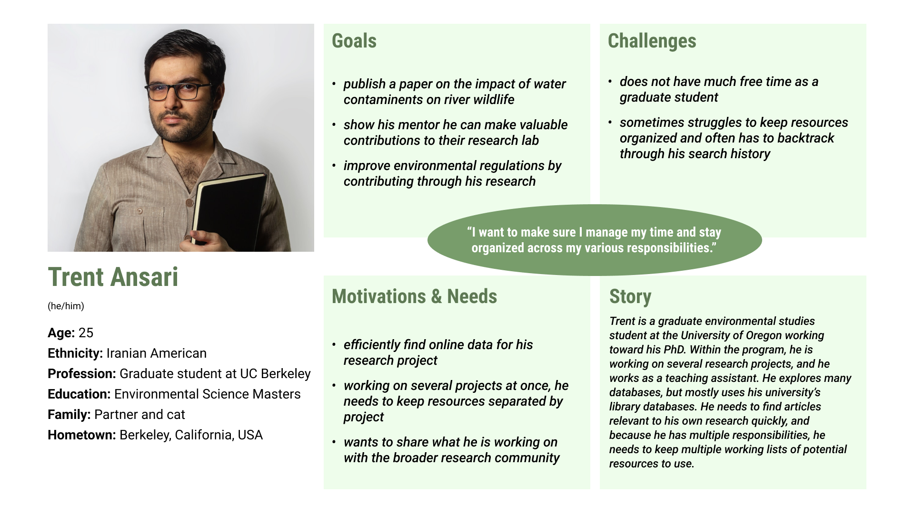
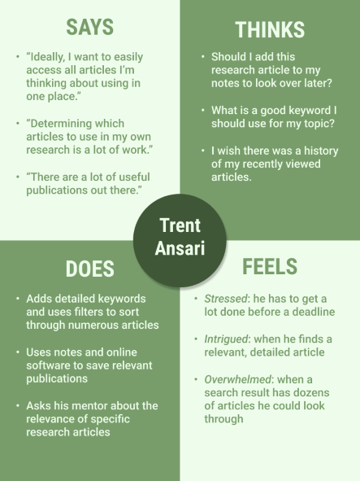

# DH110 Assignment 4 - UX Storytelling
#### by Lindsay Harrison at UCLA

## Introduction
To better understand how I should implement changes to the Southern California Coastal Waters Research Project’s (SCCWRP) website, I need to understand the goals, needs, and motivations of the website’s target users, along with the specific challenges and frustrations they face. I began my investigation of the target users by interviewing an environmental researcher. Now, I will better define this user group through UX storytelling. By creating user personas and describing a probable scenario they would face, I can better understand the user’s perspective and remove bias that may have been present in my user interview.

## Personas & Empathy Maps

### Alex Laurier - Environmental health specialist for ventura county

#### Alex's Empathy Map

### Trent Ansari - Graduate student working toward Environmental Studies PhD

#### Trent's Empathy Map

## Scenarios & User Journey Maps

### Alex Laurier

#### Why Alex is using this product

Alex works as an Environmental Health Specialist for Ventura County. Her job requires her to gather research and collect data to report on local water contamination levels and pollutants, as well as submit updates on public regulations and requirements related to environmental cleanliness. As she has always been passionate about nature, she enjoys her job and wants to be a good team member. Thus, she wants to stay up-to-date on public Southern California research projects and reports and share her findings with her coworkers. One resource she uses to complete her work responsibilities and to stay up-to-date on environmental research is the Southern California Coastal Waters Research Project’s (SCCWRP) website.

#### How Alex is using this product

After her morning meetings, Alex has time in the work office to review research. Alex knows she needs to review the new technical reports to discuss with her team members later in the afternoon. Alex opens her internet browser on her work computer and navigates to her bookmarked websites where she has the SCCWRP’s website saved. Once on the website, she scrolls down on the homepage and clicks the link to the SCCWRP’s recent publications. On the ‘Recents’ page, she scrolls down, skimming the article titles until she finds the report she is looking for. She clicks the icon indicating a PDF document of the article will be downloaded onto her computer. After it successfully downloads, she opens and reads the article, writing notes as she reads. Since she believes the report will contain relevant information and her teammates are currently reviewing other materials, she decides to forward it to them by clicking the ‘Share’ icon next to the article’s title on the webpage. She is greeted with a prompt to include her own email along with those she wants to send the article to. She does so and clicks the ‘Send’ button.

After reading the article, Alex decides she wants to take a more in-depth look at some of the SCCWRP data referenced in the report. She opens her internet browser back up where it is still on the SCCWRP’s ‘Recents’ page. She then clicks the ‘Data’ page’s link on the navigation bar. The ‘Data’ page contains a collection of links to relevant databases, organized by research topic. Alex finds the database for a southern california regional monitoring program, and within that website, she locates the specific data files referenced in the article. She then forwards those files to her team members as well.

#### Alex’s User Journey Map

### Trent Ansari

#### Why Trent is using this product

Trent is a graduate student at UC Berkeley studying environmental science. He feels a lot of pressure to publish research articles, so he is conducting several research projects with his mentor along with the help of undergraduate research assistants. Since he is directing his own research project, he looks through many online databases and through numerous publications to find research to support his project. He is interested in doing a project surrounding certain contaminants in local California water systems, and as he is in the early phases of the project, he wants to search through an online resource for water science research and data.

#### How Trent is using this product

During the day, when Trent is not attending his graduate seminar or teaching a class as a teaching assistant, he is on his computer doing research-related tasks. At his office, Trent opens an internet browser on his PC computer and navigates to the SCCWRP’s website where he hopes to search through numerous public research reports. After arriving at the site’s home page, he notices the ‘Publications’ link in the navigation bar at the top of the page. He navigates to the publications page where he is greeted with a search box and the option to select for various filters. He notices this page has links to pages for specific research topics like Microbial Water Quality and Bioassessment. He also notices some links to the SCCWRP’s recent publications are displayed on the page.

Trent knows his project will focus most heavily on the local lifeforms and ocean acidity, so he selects the bioassessment and ocean acidity filters from the dropdown menu in the search box. He also wants to begin his search session by focusing solely on journal articles, so he selects that filter as well from a separate dropdown menu. He then clicks the ‘Search’ button and is presented with a list of articles he can sort by date, author, or title. He looks through these publications, reading their abstracts. After reading an article’s abstract, if it seems useful, he adds its link to his notes. Trent does several more searches typing some phrases into the search bar in addition to the filters. At one point, Trent realizes an article he came across earlier would be helpful. Luckily, there is a ‘Recently Viewed’ display where Trent can scroll through to find that article. After coming up with a list of relevant articles, Trent is ready to move onto the next part of his research phase and exits the SCCWRP’s website.

#### Trent's User Journey Map

## Reflection

Since the SCCWRP’s target users are a specific group of people, I found it difficult to create two scenarios I thought were different enough. However, I was able to consider using the website from a public project view versus a personal research project, which I am content with. Determining persona characteristics was more difficult than I anticipated, especially coming up with two personas using the website but with different struggles and goals. I found myself writing ‘has trouble staying organized’ for both personas before I realized I needed to diversify and specify their challenges to a greater degree. Alex’s persona and scenario were difficult for me to create since I am more unfamiliar with the tasks of county researchers. I think in the future, I will do a bit more research into the tasks of a public environmental researcher since I only have a very general understanding of their responsibilities. As I am more familiar with student research, creating Trent’s persona and story were significantly easier for me.

