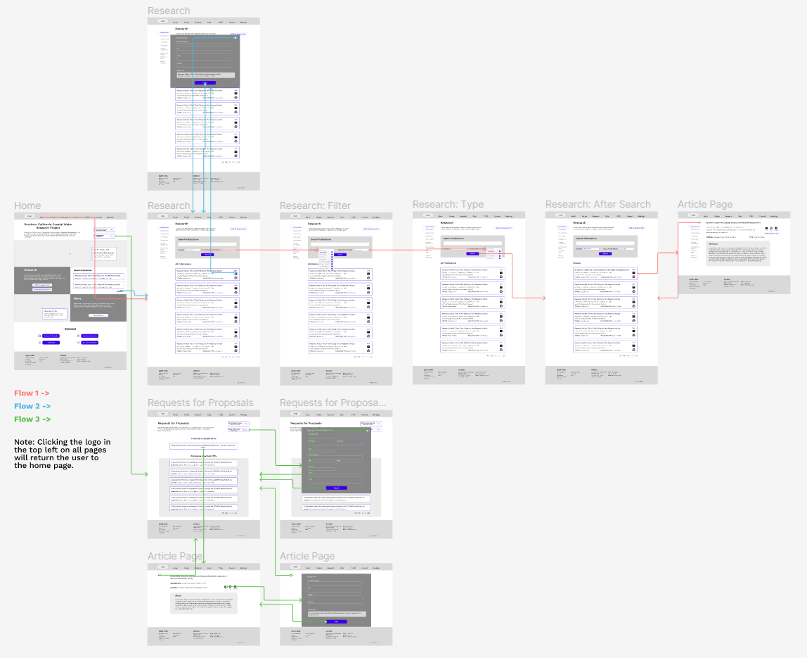
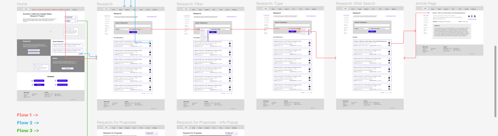
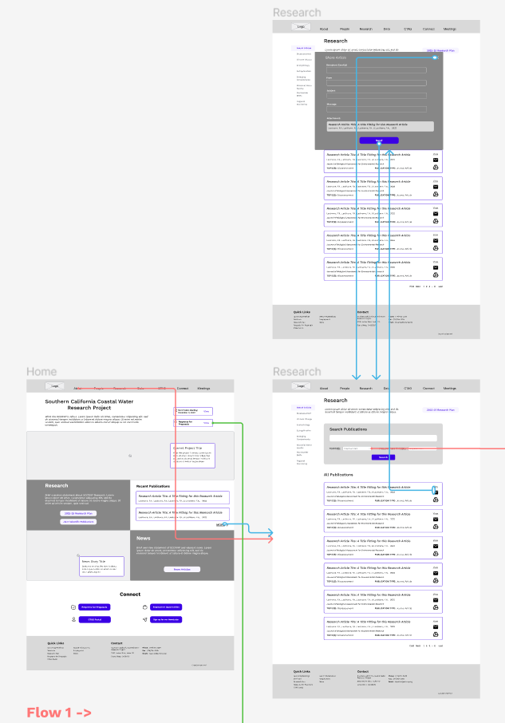
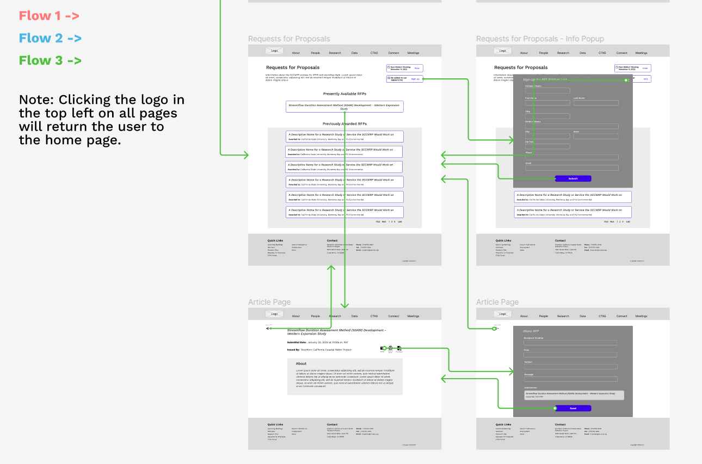
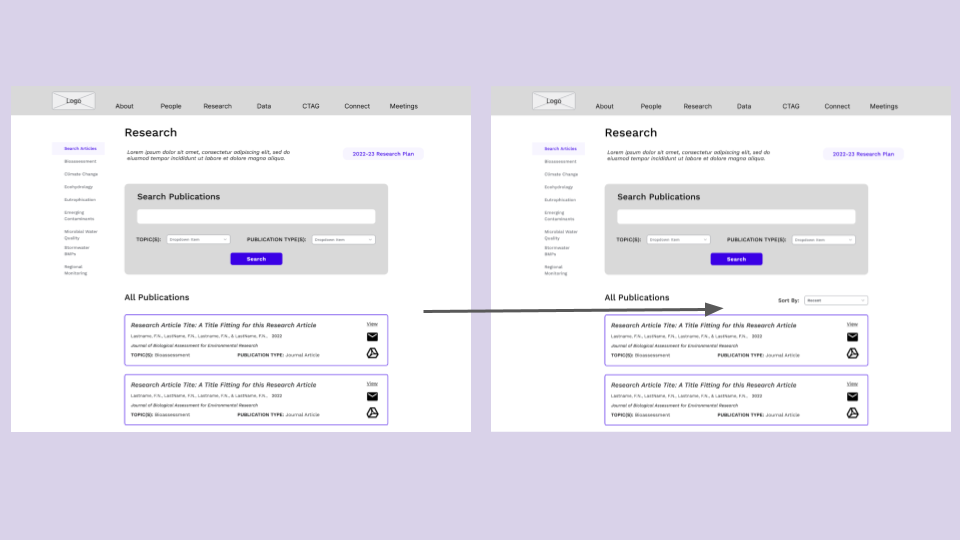
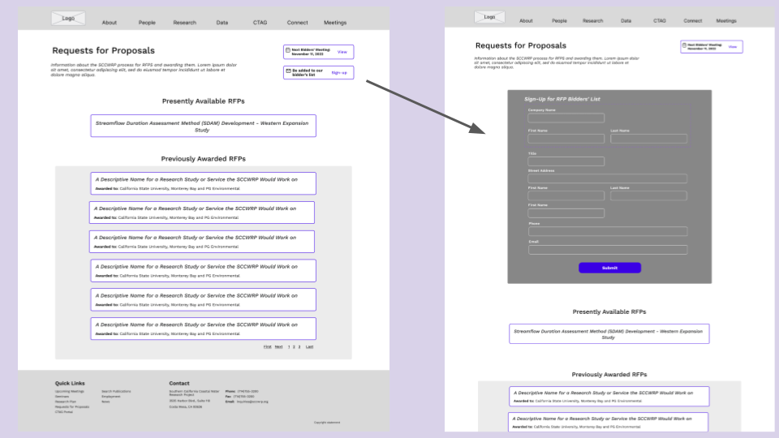

# DH110 Assignment 5 - LoFi Prototype
#### by Lindsay Harrison at UCLA

## Introduction

The Southern California Coastal Water Research Project’s (SCCWRP) central goal is to improve the management of Southern California’s ocean waters and watersheds through an enhanced scientific foundation for such management. To fulfill this purpose, they have several goals they focus on, including conducting research, serving as a public resource, and converting science to action by determining a scientific consensus to management strategies and sharing these with member agencies along with both state and federal governments. Thus, the people interested in their organization would be environmental researchers interested in their work, members of the agencies the SCCWRP informs, government environmental health workers, and government policy makers. The SCCWRP needs to support these functionalities for their users: 

1. Easily access the SCCWRP’s research
2. Review the SCCWRP’s Research Plan for the year along with their current and past Requests for Proposals
3. Find external environmental data resources

#### Researching & Defining the User

To better understand the SCCWRP’s user group, I interviewed an environmental researcher to better understand how to implement functionalities (1) and (3) within the website. From the interview, I learned environmental researchers will read dozens of articles in the process of determining what is useful to them. I also learned that environmental researchers usually have a specific topic in mind when searching for relevant research, so they can easily feel overwhelmed when a website contains an abundance of information on one page. 

From my observations and ideas surrounding this user group, I created two personas to better define the SCCWRP’s different users. One persona, Trent, fit into the environmental researcher group, and the other, Alex, was a government environmental health worker. With these personas, I wrote two scenarios for using the website. In the first, Trent is using the SCCWRP’s article search functionality to find significant research (1). In the second, Alex is sharing recent SCCWRP articles and using their linked database resources (3).

#### How to Improve the Website

The website currently consists of a home page along with the following subsections: About, Staff, Governance, Publications, Data, Contact. These pages each have various linked subpages that cannot be found within the website’s navigation bar. Considering the user needs within the website along with the pain points expressed within the user research interview and synthesized from the personas, I have determined how to improve the implementation of these three functions:

1.Easily access the SCCWRP’s research

  a. Improve general organization
  
      i. Display latest publications more clearly and place them closer to the top of the Home page/Publications page.
      
      ii. Re-style the Home and Publications pages, so they do not appear to have blocks of plain text as this may be overwhelming.
      
      iii. Include clear links to research topic pages at the top of the Publications page.
      
      iv. Include dropdown menus within the navigation bar.
      
  b. Clearer search functionality
  
      i. Redesign the search box and its functionality such that there is only one Search button and multiple filters may be chosen.
      
      ii. Include a ‘history’ functionality such that the user can easily return to previously viewed articles without error.
      
  c. Share publications
  
      i. Include an icon next to each article so researchers can send a link to an article to an inputted email or linked google drive.
      
2. Review the SCCWRP’s research plan for the year along with their current and past Requests for Proposals

  a. Make easily accessible from home page
  
      i. Finding these documents is difficult and unclear within the website when they are both significant. Thus, they should be included in the home page and should be clearly found through the navigation bar.
      
  b. Write summary of information on a relevant page then provide links//better organization
  
      i. Currently, there is no text introducing the SCCWRP’s research plan on the website; this would be more user-friendly.
      
3. Find external environmental data resources

  a. Improve general organization and clarity
  
      i. Re-design the Data page such that different types of data resources appear distinct from one another.
      
      ii. Include a display of sub-pages within the site’s Data section and include a drop-down menu within the navigation bar displaying these sub-pages.
      
      
      
      
#### Low-Fidelity Prototyping

In beginning the website’s redesign, I will create wireframes and a wireflow for two specific tasks that fall within the three general website functions described above. These tasks will be:

* Search for a recent article assessing the sea life in California’s coastal waters (relevant to 1 & Trent’s User Scenario)
* Find a the most recent publication and send it to a coworker (relevant to 1 & Alex’s User Scenario)
* Determine the presently available Requests for Proposals and submit your contact information to be added to the bider’s list (relevant to 2)

These wireframes will form a low-fidelity prototype of a new version of the website. The purpose of creating a low-fidelity prototype is to create and test a new design for a product based on the user goals and pain points previously defined. Additionally, low-fidelity prototypes allow the development team to determine how the product should be designed before extensive time and resources are allotted to creating a functional, more detailed product prototype. Producing and testing a low-fidelity prototype allows the design process to be more iterative and thus produce a better-tested final product later.

## Wireframes

[See the wireframes in this slideshow.](https://docs.google.com/presentation/d/1AQrEImimTCKslVhR3QB2rhWDf1X5kt7_WtolmxU15y8/edit?usp=sharing)

The wireframes included in the slideshow include basic designs for the website’s home page, research search page, an individual research article page, the Requests for Proposals (RFPs) page, and a page for an individual RFP. There are several iterations of the research search page displaying various popups and dropdown menu functionalities. Additionally, there is an iteration of the Requests for Proposals page with the sign-up to be on the mailing list popup.

## Wireflow & Testing

#### All Flows

### Flow 1

As depicted in Trent’s user scenario, the flow intends for the user to search for a research publication falling into specific categories (for example, a journal article dealing with bioassessment). The user begins by navigating to the research search page. Here, they are presented with all publications by the SCCWRP starting with the most recent. However, they can search through the SCCWRP’s database using the search box at the top of the page. Users have the option to type a phrase to search by, or filter the article by topic, using the topic dropdown selection, and by publication type, using the type dropdown selection. After they have fulfilled these inputs, they click the ‘Search’ button, and a list of articles by the SCCWRP falling into these categories will appear. A user can then click on the box containing the article name and view more details about the article on a page dedicated to that article. This page also contains a ‘back’ button where the user can return to the search results.

### Flow 2

As depicted in Alex’s user scenario, the flow intends for the user to send the most recent publication to someone. The journey again begins with the user navigating to the research page. Before using the search box, the page’s default state lists all SCCWRP research publications from newest to oldest, so their most recent publication is located at the top of the list under ‘All Publications.’ Having located the most recent research, the user can click on the email icon to the right. This opens a pop-up where the user can enter at least someone else’s email to send a link to the publication to. After filling out the sender’s information, clicking ‘Send’ will send the email and return the user to the research search page, without the popup. It is worth noting there is an ‘X’ on the popup. Clicking this would also return the user to the research search page without sending the email.

### Flow 1 & 2 Features Description

**Search Box:** Users can type up words or phrases that may match with SCCWRP publications.

**Topics Dropdown:** Contains a list of all the research areas the SCCWRP participates in. Users may select one or more topics to filter the list of publications by during their search.

**Types Dropdown:** Contains a list of the types of research documents the SCCWRP publishes. Users may select one or more types to filter the list of publications during their search.

**Email Icon:** On each research publication item box, it allows the user to send an email with the publication attached to any given email address. It causes a pop-up to appear, requesting the necessary information to send the email.

**Add-to-Drive Icon:** On each research publication item box, it allows the user to add the article to their google drive.

**Back button:** Returns the user to the previous page - on the individual article page, allows the user to return to their search results.

**Download PDF Icon:** In the individual article page, downloads a PDF of the research publication to the user’s computer.

**Access Full Document Button:** Opens a new page, sending users to the webpage of the journal the article was published in.

### Flow 3

Since a big user group for the website includes independent environmental researchers and members of agencies/organizations the SCCWRP informs, it is important the website can easily direct users to Requests for Proposals (RFPs) information. Thus, the third flow depicts how a user would add their contact information to the RFP bidders’ list and find information about available RFPs. The flow begins with the user navigating to the RFPs page from the home page. Once on the RFPs page, they can view available as well as previously awarded RFPs; there is a list of both, and clicking on one will take the user to a more informative page about the specific RFP. Additionally, there is a button on the RFPs page to add their name to the bidders’ list. Clicking on this will generate a popup where the user must input their company and personal information. Clicking ‘Submit’ to the popup will add the user to the mailing list and close the popup. Clicking the ‘X’ on the popup will also close it but will not add the user to the mailing list.

After entering an individual RFP’s page, the user can email a link containing a description of the RFP to an inputted email address by clicking the email icon. This displays a popup similar to the popup for emailing a research article; the user can give the necessary email information and click ‘Send’ to send the email.

### Flow 3 Features Description

**View next bidder’s meeting button:** Takes the user to the site’s Meetings page.

**Sign-up for bidder’s list button:** Clicking causes a popup to appear where a user can fill in their personal and company information to add themselves to the RFP bidder’s list.

**RFP item box:** Boxes for each past and present RFP, containing its name. Clicking will send the user to that RFP’s information page.

**Email Icon:** On an RFP information page, it allows the user to send an email with the RFP document attached to any given email address. It causes a pop-up to appear, requesting the necessary information to send the email.

**Add-to-Drive Icon:** On an RFP information page, it allows the user to add the RFP document to their google drive.

**Back button:** Returns the user to the previous page - on the individual RFP page, allows the user to return to the general RFP list page.

**Download PDF Icon:** On an RFP information page, downloads a PDF of the RFP document to the user’s computer.

## Prototype Testing

[Link to digital low fidelity prototype](https://www.figma.com/proto/iT6y4RFBslbaPMLKNauFgU/DH110-a5?node-id=38%3A1795&scaling=scale-down&page-id=38%3A1794&starting-point-node-id=38%3A1795)

[LoFi Prototype Test Video](https://drive.google.com/file/d/1cFlWNbEbMLatkdYvnwStZV8xLqwgSVzH/view?usp=sharing)

[LoFi Prototype Test Notes](https://docs.google.com/spreadsheets/u/0/d/1ZWF1zEtIlkvKSI6aSftG6iurmJ_1jE4olVHa0YbvN9E/edit)

Based on the prototype testing, I believe users could complete the three tasks defined in the wireflow. The participant was able to easily follow said flow although she did express some hesitation and uncertainty during some parts. From the prototype testing, I learned that users can easily identify and use functionality marked with icons. I instructed the participant to send two different documents within the prototype, and she was able to identify where and how to do that quickly by the envelope icon. Additionally, I learned that commonly used web design practices and functionality - like use of a navigation bar and having a website logo return the user to the home page - were recognized by my participant. However, there are a few ‘pain points’ that could be improved in the design. First, the participant was confused why a popup to sign up for the bidders list was utilized over embedding the sign-up within the page. She felt the similar buttons between navigating to the RFPs page and signing up for the bidder’s list within the RFPs page were confusing. Moreover, the user also had difficulty figuring out which articles were recent on the research page. I think I took for granted that by listing all the publications, the user would think the most recent would be listed first, but I should make that more explicit.

## Revisions

Based on what I learned from the prototype testing, I have identified two user pain points along with what I would do to fix them:

* PAIN POINT 1: The organization of ‘All Publications’ on the research page should be more obvious and adjustable.
    FIX: Add a ‘sort by’ function at the top where it specifies the default is to list the publications from newest to oldest.
    
* PAIN POINT 2: Signing up for the bidder’s list on the RFPs page should be more intuitive.
    FIX: Embed the email signup within the RFPs page and get rid of the popup. Place it before the list of available RFPs.
    
    
    
PAIN POINT 1: Redesigning the research page.

PAIN POINT 2: Redesigning the RFPS page.

[View the redesigned wireframes in more depth here.](https://docs.google.com/presentation/d/1gE5VhjqKuWzoEAxvut25vJpeqkhbw36oiluVrH2JMW4/edit?usp=sharing)

## Reflection

The wireflow testing process began with me introducing the activity we would do before reading the participant a task the website prototype should accomplish and observing how the user went about achieving that task. Overall, I think the testing process went smoothly; the participants executed most tasks quickly and mostly narrated their thought process out-loud. I expected there might be some awkwardness due to the prototype’s nature, and while there was, the participant was not as nearly distracted by the awkward transitioning and dropdown menu functionality as I thought they would be. However, I did not expect the participant would find a similar layout between pages to be more confusing than a dissimilar layout, but I think the dissimilarity would have helped the participant to realize they had landed on a new page with a different purpose. Additionally, I did not anticipate the participant would be unable to reach the homepage from the individual RFPs page since I did not correctly prototype that page. In the future, I will be sure to create a link from each page to the homepage as I intended. I think I would utilize Figma’s components feature to ensure this.

Based on how the prototype testing went, I think I would try to present tasks in clearer steps rather than state everything a participant needs to accomplish relevant to a task all at once - or I should write shorter but more tasks. I think the instructions I gave this time were too detailed to give all at once. As aforementioned, I would also double check that all prototype connections were working before having a participant test the prototype.

As previously discussed in the prototype testing section, the user felt signing up for the bidders’ list was less intuitive than it could be, and it was not extremely obvious that publications were organized by recent. In the revisions section, I added a sorting option to the research page to define how the publications were appearing along with giving the user more freedom to determine their order of appearance. Furthermore, I determined I should integrate the bidders’ list sign-up within the page itself rather than include it as a pop-up. As for the future designs of the website based on user feedback, I think I would need to conduct another round of testing to see if the revisions made a difference in the overall website’s flow. Before a second round of testing, however, I think I would try to use more iconography to highlight the most recently published articles on the research page. Additionally, I could add the email and download-pdf icons to the RFP items on the RFP page, so users can share the documents without entering the individual RFP’s page.

