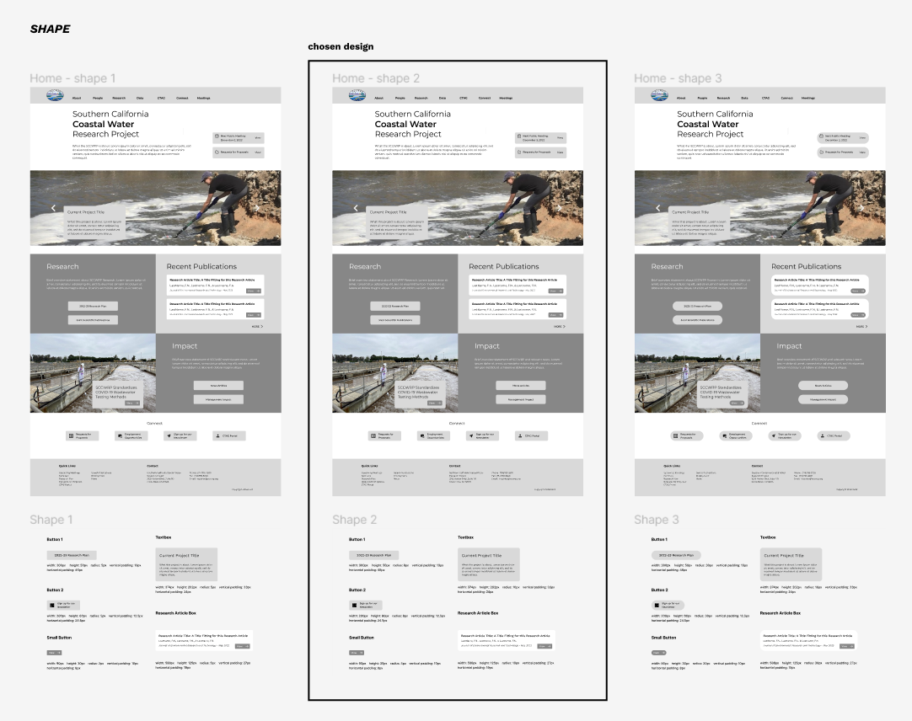
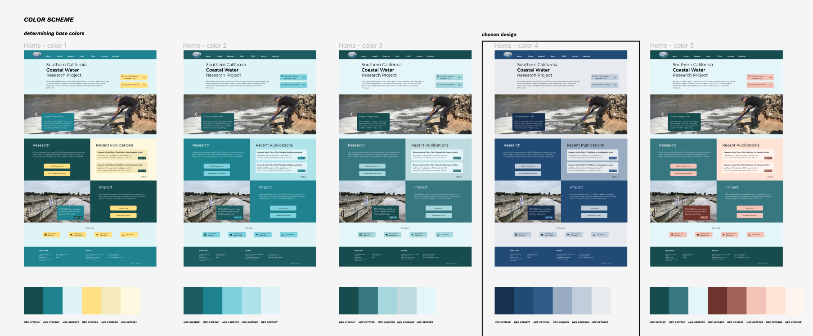
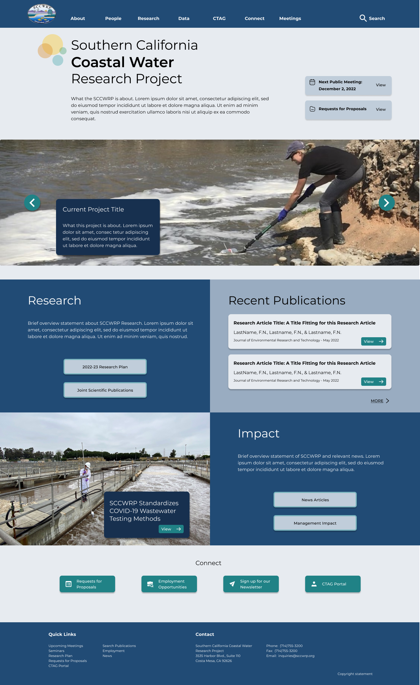

# DH110 Assignment 6 - Interface Design
#### by Lindsay Harrison at UCLA

## Introduction

To improve the Southern California Coastal Water Research Projects’s website, I have designed an interactive prototype focusing on three main tasks a user would complete with their website. From conducting user research, creating personas, and determining the user flow, these tasks were defined as:

1. Search for a research article relevant to a particular topic.

2. Access the most recent publication and share it with other researchers, or to your own google drive.

3. Determine the presently available Requests for Proposals and submit your contact information to be added to the bidder’s list.

[Digitized Wireflow](https://www.figma.com/file/iT6y4RFBslbaPMLKNauFgU/DH110-a5?node-id=0%3A1)

[Digitized Lo-Fi Prototype](https://www.figma.com/proto/iT6y4RFBslbaPMLKNauFgU/DH110-a5?node-id=38%3A1795&scaling=scale-down&page-id=38%3A1794&starting-point-node-id=38%3A1795)

After previously determining how these tasks would function within the website by creating a wireflow, I will now determine a more polished design for the website. In this part of the project, I will explore different typography, shape, and color variations for the website’s home page (see wireframe version below). The purpose of interface design is to translate wireframes into more finalized, polished designs by utilizing graphic design principles. These designs will later be part of a high-fidelity prototype resembling the finished product. To complete the process of interface design, I used Figma as my design tool and the MacBook Pro 14” screen size to frame the overall design. After determining a design I was satisfied with, I conducted an impression test and ran an accessibility test to determine how my designs could be improved.

[Figma Full Design Page](https://www.figma.com/file/OY3VXN8Be64MsOgbQiatGE/DH110-a6?node-id=0%3A1)

### SCCWRP Home Page Wireframe

## Layout

#### Home Page Layout

#### Decision Process

For the initial interface design, I decided to use the website’s home page since it would be the first page a user lands on and should easily connect the user to the tasks relevant to different users. The page’s overall layout includes: a small blurb about what the SCCWRP is, links to the Meetings and Requests for Proposals pages, a display image showcasing a current project, a blurb about their research along with links to their research plan and joint publications, a display of a few of their recent publications, a short blurb about their impact along with a link to relevant news articles, a display of a current news story regarding the SCCWRP, and finally, links to employment opportunities, their newsletter, and the CTAG Portal.

For the main grid layout, I used five rows with a 0ps margin and a 50px gutter. I also used two columns with a 100px margin and a 20px gutter. This layout helped me to divide the Home Page’s contents into five sections based on the rows, and the two columns helped me to determine where I should align the elements. The column margins were used to determine how far elements should be placed to the left or right. In addition to the columns, tools allowing me to distribute horizontal and vertical space among elements were a great help in achieving the above layout.

## Typography

#### Decision Process

Since the website concerns government and government-sponsored agencies, I wanted it to look clean and professional. First, I considered Noto Sans Javanese since it is an easy-to-read sans serif font that also comes off as professional. I also wanted to consider the look of a serif font, so I tested Bitter as well. After considering these, I realized I preferred the sans serif Noto Sans Javanese since it is much neater than Bitter; I felt the higher detail within Bitter might conflict with the photos, numerous buttons, and other details on the homepage. Thus, I was leaning toward Noto Sans Javanese but wanted to consider one final font - another sans serif - to compare with my first choice. I found Montserrat and liked its even lighter look and feel compared to Noto Sans Javanese. I additionally preferred Montserrat’s more horizontal spread and thought it was fitting given I had laid out the page’s elements in horizontal strips. Therefore, I chose to use the Montserrat font family for the website. You can view the specific font size, weight, letter spacing and line spacing for the various texts that I chose in the bottom right display above.

## Button Shapes

#### Decision Process

Focusing on a clean and professional look, I decided against trying an extremely artistic style for the button shapes. However, I still wanted to investigate how different levels of roundness would appear within the overall design, so I tried three variations: rectangular, rounded rectangular, and pill-shaped. I decided against the rectangular variation since I thought it did not look polished enough. I decided against the pill-shaped version since I thought the extreme button roundness contrasted with the rectangular edges of the background elements and gave the website a less serious feel. I thought the slightly rounded rectangular version was a more polished version of the first iteration, so I went with that design. View the bottom middle button description for the width, height, padding, and corner radius used for the chosen button designs.

## Color Scheme

#### Variations for Base Color

#### Variations for Accent & Dark Mode

#### Decision Process

To decide what colors to use in my design, I first decided on a base color palette before determining a suitable accent color and then adjusting the design to a dark mode. Because the SCCWRP evokes imagery of the ocean, I played with different variations of blue along with complementary warm colors in determining the base colors. I ultimately did not like the complementary warm colors with the blue as I thought it made the design too chaotic and unprofessional. My favorite base color palette was a series of deep blue shades I felt best reflected the website’s professional and informative tone. Next, in deciding an accent color, I chose three shades I thought might make the interface more interesting while fitting the ocean research theme. Of these, I preferred the bright teal color as I thought it appropriately drew the eye and did not conflict with the base colors as much as the other two. Finally, I adapted these colors into a dark mode by using the darkest shade as the primary base color. However, I was not entirely satisfied with the dark mode using the teal accent color since I thought the teal did not complement the darker shades as well. Thus, I made another variation with the green accent color and decided to go with that design for the website’s dark mode.

## Accessibility

To ensure my design was accessible, I ran a color-contrast check of all the different font-background color combinations of my design using the Stark Figma plugin. Checking the first time, I noticed the small button color (which is the accent color) did not have a high enough contrast ratio for the white text, so I chose a slightly darker teal color for the light mode, and a slightly darker green color for the dark mode (see picture below).

#### New Accent Colors for Light & Dark Mode

After adjusting the accent colors, I ran the contrast checking tool again on all color combinations. All combinations had a ratio of at least 4.5:1, thus satisfying the WCAG 2.0 AA accessibility requirement for webpages. The detailed results are shown below.

### Light Mode

### Dark Mode

## Impression Test

After coming up with a nearly finalized design, I decided to learn how my design would be perceived by others by conducting a quick impression test on a user. In an impression test, the researcher flashes their design on-screen for five seconds without warning the user beforehand how long they will be looking at the design. Once the five seconds are up, the researcher asks the participant what they thought of the design, what words or graphics they remember, and anything that came to mind while they had viewed the design. The test is well suited for understanding the look and feel of the design. Below are two links, one is a test link where you can try out the test similarly to how the participant did the test with me, and the other link leads to a video showcasing my experience conducting this test.

[Test Link](https://app.usabilityhub.com/do/192579713d57/3f34)

[Test Video](https://drive.google.com/file/d/1_LCej-U7pmrCed5RnvtsGxTCMxCYYtR9/view?usp=sharing)

#### Summary of Findings

From the impression test, I learned my design is perceived as clean and official. The participant distinctly remembered the “Research” and “Impact” sections of the page, indicating those stand out as important like I intended. They also distinctly remembered the main photo on the page along with the brightly colored buttons, indicating those graphics effectively capture user attention. The user appeared to have a positive experience viewing the design as they commented it was “nicely laid out” and it came off as “not jumbled.” They did not comment on anything that could be improved, even when prompted, but indicated they might need to view the screen for longer. Since they commented positively on the design’s professionalism and that all elements were easy to see, I believe my design accomplishes the look-and-feel I sought to create.

## Finalizing the Design

Upon completing the basic design process, the home page used the Montserrat font family, a deep indigo color palette with a teal-green accent, and featured a rounded-rectangular look to the on-screen buttons. Below I have laid out all of the specifics of these features, including the exact hex codes for the colors used, the exact size, weight, letter spacing and line spacing for the different text types used, and the exact dimensions and edge roundness of the buttons used in the design.

To finalize my designs, I used the drop shadow feature on the buttons and floating text boxes to draw the eye to important information and action items on the screen. I also added a little geometric design close to the page’s header to draw attention, and added a search option to the navigation bar as it had previously been absent when it should have been present.

Throughout the design process, I kept the ideas of clarity and simplicity in mind. I wanted the website to feel easy to use and informative, so I made sure texts had a high contrast ratio, and that the eye was drawn appropriately to on-screen information with the use of buttons and graphics. Professionalism was another central idea I kept in mind while creating the website; while I wanted it to be easy to use and cater to several types of users, it needed to be professional-looking and somewhat understated as a government-sponsored website. Ultimately, I am satisfied with the results of the interface design process and believe the design to fall in line with these ideas.

### Final Design Light Mode

### Final Design Dark Mode

#### Final Design Typography

#### Final Design Button Shape

#### Final Design Color Scheme

## Reflection

