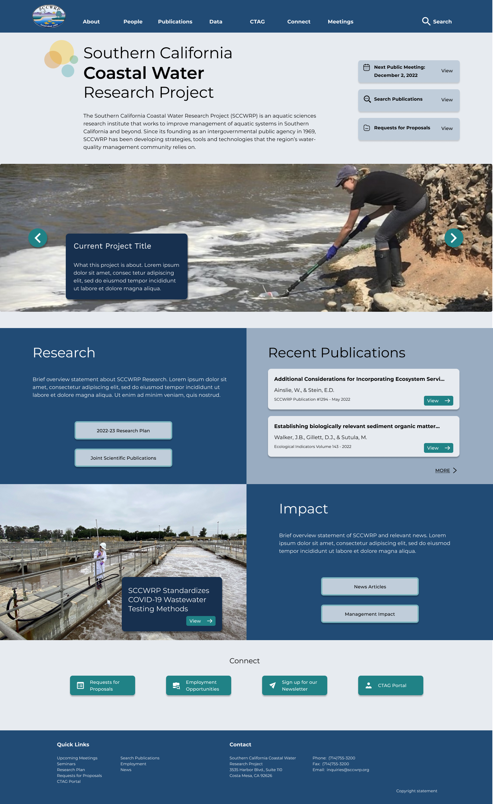
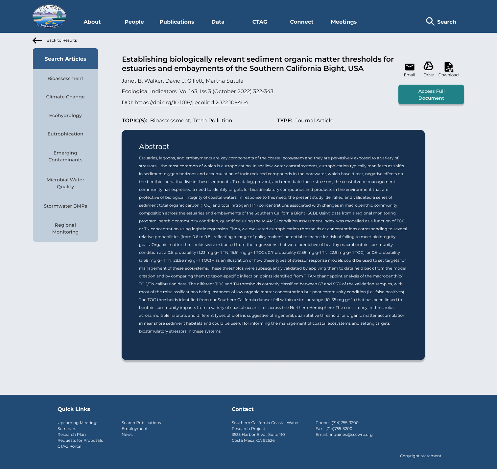
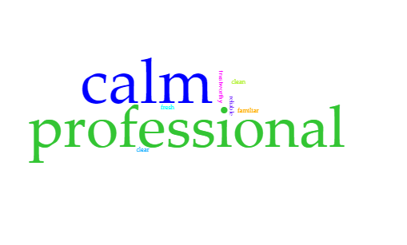
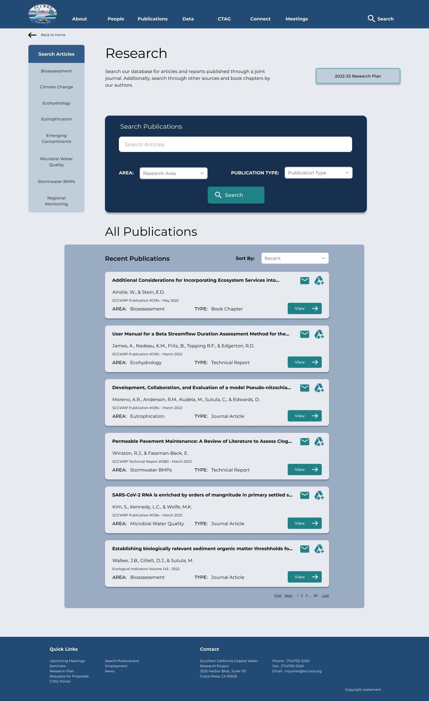
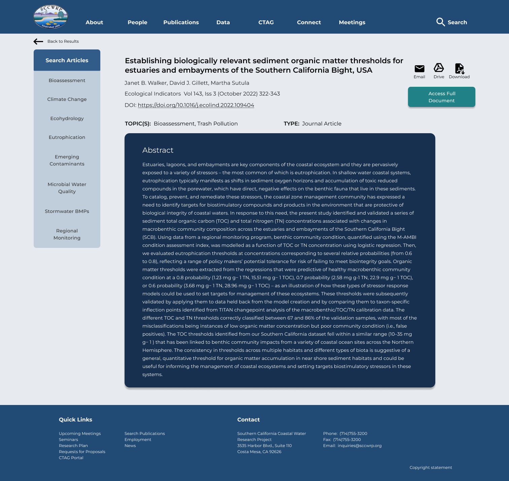

# DH110 Assignment 7 - High-Fidelity Prototype
#### by Lindsay Harrison at UCLA

## Introduction

After determining a more polished design for my redesign of the Southern California Coastal Water Research Project’s website, I moved forward to create a high-fidelity prototype of the website using Figma. The purpose of creating a high-fidelity prototype is to better visualize how information and elements appear on screen and to better understand the interactive components of the site and how exactly the user flow will function. Thus, for this portion of the project, I applied my designs to additional pages previously defined in the low-fidelity prototype and connected the pages through buttons and transitional animations to create an interactive high-fidelity prototype.

Similar to the tasks designed in the low-fidelity prototype, the tasks the interactive high-fidelity prototype will support include:

**TASK 1: Search for a journal article assessing the microbiology in California’s coastal waters.**

**TASK 2: Find a recent publication and email it to someone (a coworker).**

**TASK 3: Determine the presently available Requests for Proposals and submit your contact information to be added to the bider’s list.**

## Wireflow

The image below depicts the three user flows for the tasks defined above. Note that Flow 1 corresponds to Task 1, Flow 2 corresponds to Task 2, and Flow 3 corresponds to Task 3. [A version of the wireflow on Figma can be accessed here](https://www.figma.com/file/xzR7iIfVUL9oAgz11oa84v/DH110-a7?node-id=0%3A1&t=HDWBIAsZvYYLnl1a-1) - make sure to view the page titled “Wireflow - Website.”

### Website Wireflow - Full View

### Website Wireflow - Flows 1 & 2

### Website Wireflow - Flow 3

From my user research, I came to believe the SCCWRP’s website would be mostly accessed through a desktop or personal computer, during research or professional activities. However, since phones are more easily accessible and more and more organizations are expanding to better cater to a mobile audience, I decided to additionally design and create a wireflow for a mobile version of the SCCWRP’s website. The image below depicts the three user flows for the tasks defined above, but a mobile version. Note that Flow 1 corresponds to Task 1, Flow 2 corresponds to Task 2, and Flow 3 corresponds to Task 3. [A version of the mobile wireflow on Figma can be accessed here](https://www.figma.com/file/xzR7iIfVUL9oAgz11oa84v/DH110-a7?node-id=18%3A1427&t=HDWBIAsZvYYLnl1a-1) - make sure to view the page titled “Wireflow - Mobile.”

### Mobile Wireflow - Full View

### Mobile Wireflow - Flows 1 & 2

### Website Wireflow - Flow 3

## Interactive Prototype

Although both mobile and website versions of the SCCWRP’s interface were designed, I decided to keep my focus on the website version since that would be how users mainly access the interface, as explored in my user research.

[View the interactive website prototype here.](https://www.figma.com/proto/xzR7iIfVUL9oAgz11oa84v/DH110-a7?node-id=19%3A1753&scaling=min-zoom&page-id=19%3A1752&starting-point-node-id=19%3A1753)

[View the Figma file for the interactive prototype here](https://www.figma.com/file/xzR7iIfVUL9oAgz11oa84v/DH110-a7?node-id=18%3A1427&t=HDWBIAsZvYYLnl1a-1) - be sure to visit the page titled “Web Prototype.”

## Cognitive Walkthrough

To determine the effectiveness of the user flow designed in the high-fidelity prototype, I conducted a cognitive walkthrough with two peers. In a cognitive walkthrough, users are presented with the tasks a prototype is able to complete, and they are asked questions about their overall impression of the prototype, how well they understand the prototype’s feedback along with their progression through the task, and how the user flow and design may be improved. A cognitive walkthrough is useful for investigating if a user can identify goals within the prototype, identify action items, and to see if they can connect subgoals with action items as they progress through a task.

#### Cognitive Walkthrough Data

#### Comments Written on the Prototype

##### Participant 1

* “the dropdown interaction is very nice—some of boxes are a little bit too big when trying to navigate to another menu item”
* “perhaps rename the menu item [‘Research’] as articles instead?”
* (about the back button)“small detail, but it is distorted”
* (about the back button) “put back button more to the left”
* “make the connect header slightly bigger/bolder so that it is more noticeable”

##### Participant 2

* (in some whitespace at the top of the homepage)”Adding a direct link to the publications here”
* (about the back arrow)”this arrow looks very stretched”
* (noticing navigation dropdown at the top of a page)”transparency of dropdown doesn't match the rest”

#### Takeaways

Based on the feedback from the cognitive walkthrough, I learned that my website’s design comes off overall as clean and professional. However, their feedback highlighted some slight adjustments I should make to improve ease of navigation and clarity. Thus, I will make the following adjustments before I move on to usability testing:

1. Touch up the dropdown menu navigation:

      a. Ensure is fully functional on all pages
  
      b. Change the ‘Research’ tab to be titled ‘Publications’ instead
  
      c. Make the areas of research more distinguishable from the general research pages
  
2. Make the back button placement consistent across all pages and bolder

3. Add a direct link to research publications at the top of the home page

## Usability Testing

Before conducting the usability tests, I updated my prototype according to the above altercations. [View the updated wireflow in the figma workspace.](https://www.figma.com/file/xzR7iIfVUL9oAgz11oa84v/DH110-a7?node-id=0%3A1&t=5wJErWpROir2SBKx-1) Since the two main pages altered were the home page (note the navigation bar and third button near the page's top) and individual research article page (note the placement of the back button), I have included the updated designs below:

##### Updated Home Page

##### Updated Article Page

Two usability tests were conducted. One was purely over Zoom, and the other was in-person, though the tested user still recorded their reactions and screen using Zoom. The in-person test was conducted in a public setting, specifically in a Starbucks cafe. A link to the usability testing form can be found here. The testing form follows the same format as the initial pilotted usability test although the tasks themselves are different and follow those described above. The tasks for finding and sharing research were preserved, though the task for finding data was removed, and the task for exploring Requests for Proposals was introduced.

### First Usability Test - 5:30pm PST  11/21/22 (~25min)

My first participant is an accountant who also writes for National Geographic. She often investigates current environmental topics in her writing and often writes about ocean-related topics; she is currently working on a piece on technology used to survey sharks. Although she had never used the SCCWRP’s website, she is familiar with environmental research topics. [A link to her usability test recording is here.](https://drive.google.com/file/d/1DfWPawzgFPXeDADB62T0ucidzTieViuI/view?usp=sharing)

#### Summary of Insights

As the participant uses environmental research as more of a hobby rather than for her career (writing for National Geographic is not her main job), the participant approached the website in a more exploratory sense, as she would normally use a website like this for learning purposes. Viewing the website in a less technical light, she paid a lot of attention to large headers and buttons rather than individual article/RFP titles and caption or body texts. Overall, she thought each page had a clear display, and that each task was straightforward and streamlined well within the website.

However, the participant did make a note that the homepage’s various colored boxes of text combined with the images felt a bit overwhelming to her at first. Additionally, I noticed the participant took more time than I had expected for the second task where she seemed a bit unsure as to where the recent articles were stored. She eventually realized the title ‘All Publications’ along with the sort dropdown being set to ‘Recent’ indicated she was in the right direction, but I think it could have been more easily recognizable.

### Second Usability Test - 2:15pm PST 11/22/22 (~30min)

My second participant is a fourth-year undergraduate student studying environmental engineering at California State University, Humboldt. As such, she has much experience searching for environmental research to use in class assignments resembling industry technical reports. She is familiar with both hydraulics and hydrology and has studied water research intensively. [A link to her usability test recording is here.](https://humboldtstate.zoom.us/rec/share/6fRjCE1xm2xTWRVNeqVRHCjSalOJncx83zTqazDoDElM7h3j40sYLjOFC3_ReKBc.J8-21oA8j5G7paOe?startTime=1669155397000)

#### Summary of Insights

Since the participant uses environmental research for her schoolwork and in preparation for her career, she navigated through the prototype in a more thorough manner than the first participant. The second participant looked more at the individual article titles and subject matter, and appeared to read through the body texts more so than the first participant. Although she commented she did not use many environmental organization research websites, she uses many organization databases and her university library website within her projects. She reported using this site felt familiar or similar to her previous experiences looking for articles.

In the first task, I noticed she seemed to struggle to read the abstract’s text. This may indicate the text needs to be sized up, though the figma prototype was also sized significantly smaller than her desktop screen size. Additionally, she commented that she did not see a large use for the email feature in Task 2 although she appreciated the option was there and very clearly presented.

### Usability Tests - Overall Summary

Although my sample size was small (n=2), I thought both participants had adequate experience with environmental research in different contexts and provided valuable insight into my design.

**Age Range:** 21-24

**Gender Identity:** Both identified as female

**Language:** English was the primary language for both participants

**Task Completion:** 100% - All participants could complete all tasks

**System Usability Scale (SUS) Score:** 64.17 (based on in-class calculation method where the average of all scores was found before dividing by 6 and multiplying by 100)

**Production Satisfaction Card Summary:**
[An interactive view.](https://voyant-tools.org/?corpus=f82497844fe2f72704bd53451d625819&view=Cirrus)

The top two adjectives chosen were calm and professional. While the first participant was explaining her selection of descriptive words, she said she chose words like calm, professional, and reliable since the website seemed informational and an interface to be used for work or school. When asked about choosing the professional adjective, the second participant commented she thought the website felt safe, and when asked about the “calm” adjective, the participant commented the website did not overload her with information - she was not afraid of getting lost within the website.

## Revisions

From the results of the usability tests, I had the impression my website was functional and conveyed the professional and informational tone I wanted. My participants seemed to enjoy their experience and easily complete the tasks. Thus, there were no large revisions to the user flow to make to my prototypes, but based on their comments, I decided to implement some minor changes to the designs:

* Since the first participant took longer than I would have liked in finding where recent publications were, I decided to make a subtitle on the Search Publications Page reflecting the default sort setting was recent publications.

* The second participant struggled to read the abstract text on the Individual Article Page, so I decided to resize the set text size for the abstract text box.

##### Updated Search Publications Page

##### Updated Individual Article Page

## Reflection

(11/16/2022)

Although I decided to both design a mobile and desktop version, I did not find creating the mobile version to be as time-intensive as I would have expected. I simply adjusted the components and focused the screens’ attention on fewer elements at a time. Expanding the design from the homepage to the other pages also was not too difficult, as I expected, although perhaps I will consider adding more interesting graphic elements to the subpages in the future. One element of the prototyping process I did not expect was how difficult it was to determine which animations to use for the website prototype. When using websites, I find I am often not consciously aware of the transitions between screens, likely also because screens often have difficulty loading, so there are pauses between such transitions. I had to test numerous different animation combinations, and I am still somewhat unsatisfied with the results. However, I believe the user feedback gained through the usability tests will help inform me as to what animation style I should use.

(11/22/2022) - Post Cognitive Walkthrough & Usability Testing

I found the cognitive walkthrough to be insightful, which was as expected. However, I did not expect it to be as reflective as it was. The peers reviewing my designs by walking through the tasks would consider a web element within one task before reconsidering it in another task. They left thoughtful comments on the prototype, which I appreciated. I believe I gave participants all tasks before talking over their impressions and experiences. Though, in the future, I think I would give them a task, discuss their comments, and then move onto the next task before repeating.

As for the usability tests, they overall went as expected, though I think there were aspects I could improve upon in the future. I am on friendly terms with both participants, so I found it difficult to keep my language professional when communicating with them during the usability test. Additionally, I think I could have scripted more specific follow-up questions to ask participants at the end of each task rather than simply asking them to speak more on their overall experience and impressions during the tasks.

