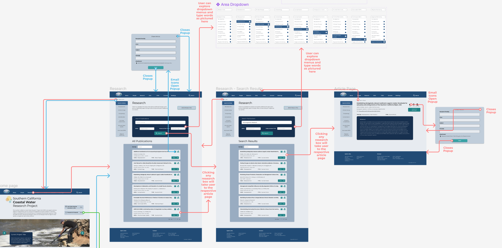
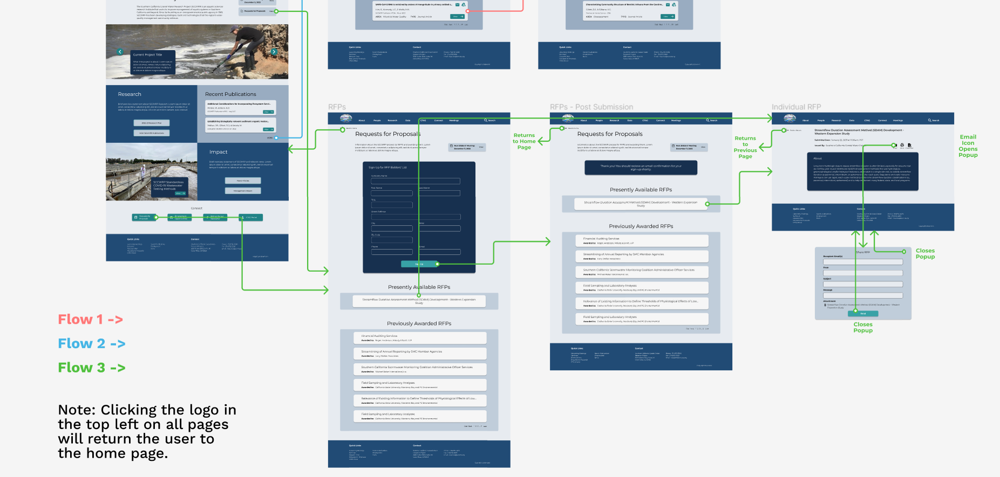
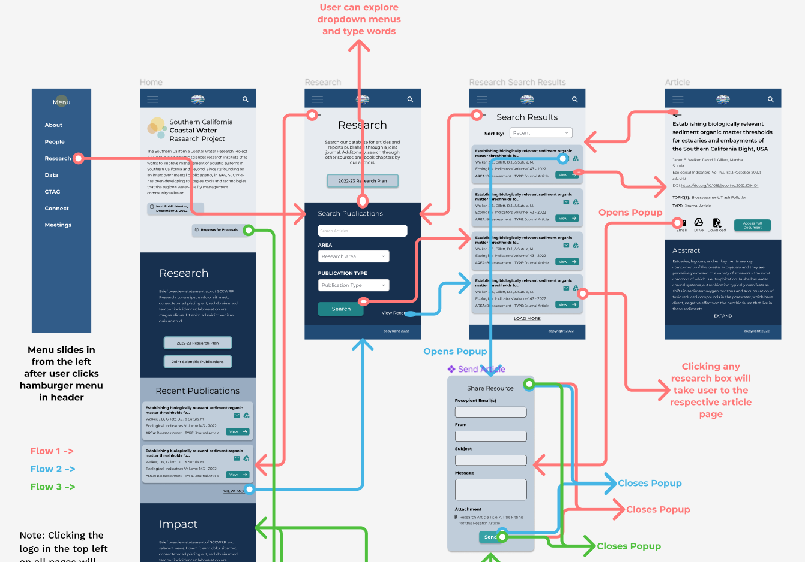
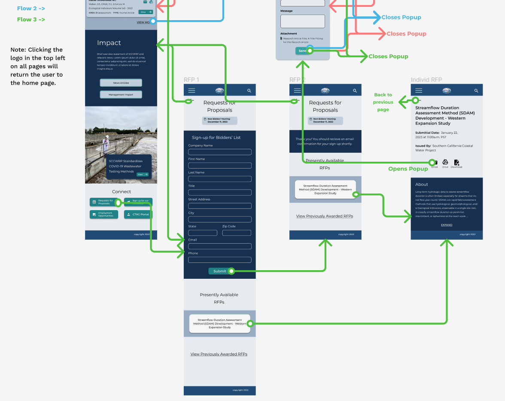
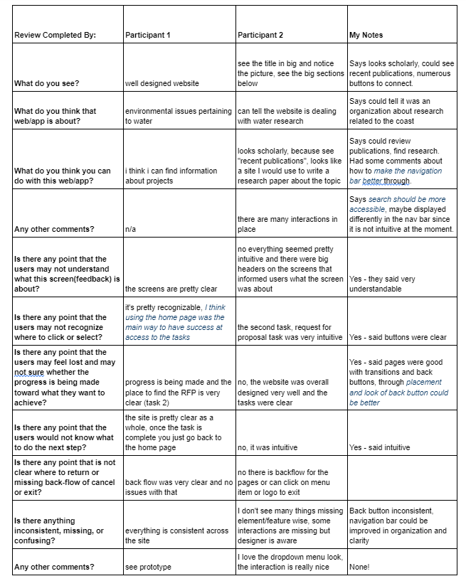

# DH110 Assignment 7 - High-Fidelity Prototype
#### by Lindsay Harrison at UCLA

## Introduction

After determining a more polished design for my redesign of the Southern California Coastal Water Research Project’s website, I moved forward to create a high-fidelity prototype of the website using Figma. The purpose of creating a high-fidelity prototype is to better visualize how information and elements appear on screen and to better understand the interactive components of the site and how exactly the user flow will function. Thus, for this portion of the project, I applied my designs to additional pages previously defined in the low-fidelity prototype and connected the pages through buttons and transitional animations to create an interactive high-fidelity prototype.

Similar to the tasks designed in the low-fidelity prototype, the tasks the interactive high-fidelity prototype will support include:

**TASK 1: Search for a journal article assessing the microbiology in California’s coastal waters.**

**TASK 2: Find a recent publication and email it to someone (a coworker).**

**TASK 3: Determine the presently available Requests for Proposals and submit your contact information to be added to the bider’s list.**

## Wireflow

The image below depicts the three user flows for the tasks defined above. Note that Flow 1 corresponds to Task 1, Flow 2 corresponds to Task 2, and Flow 3 corresponds to Task 3. [A version of the wireflow on Figma can be accessed here](https://www.figma.com/file/xzR7iIfVUL9oAgz11oa84v/DH110-a7?node-id=0%3A1&t=HDWBIAsZvYYLnl1a-1) - make sure to view the page titled “Wireflow - Website.”

### Website Wireflow - Full View

### Website Wireflow - Flows 1 & 2

### Website Wireflow - Flow 3

From my user research, I came to believe the SCCWRP’s website would be mostly accessed through a desktop or personal computer, during research or professional activities. However, since phones are more easily accessible and more and more organizations are expanding to better cater to a mobile audience, I decided to additionally design and create a wireflow for a mobile version of the SCCWRP’s website. The image below depicts the three user flows for the tasks defined above, but a mobile version. Note that Flow 1 corresponds to Task 1, Flow 2 corresponds to Task 2, and Flow 3 corresponds to Task 3. [A version of the mobile wireflow on Figma can be accessed here](https://www.figma.com/file/xzR7iIfVUL9oAgz11oa84v/DH110-a7?node-id=18%3A1427&t=HDWBIAsZvYYLnl1a-1) - make sure to view the page titled “Wireflow - Mobile.”

### Mobile Wireflow - Full View

### Mobile Wireflow - Flows 1 & 2

### Website Wireflow - Flow 3

## Interactive Prototype

Although both mobile and website versions of the SCCWRP’s interface were designed, I decided to keep my focus on the website version since that would be how users mainly access the interface, as explored in my user research.

[View the interactive website prototype here.](https://www.figma.com/proto/xzR7iIfVUL9oAgz11oa84v/DH110-a7?node-id=19%3A1753&scaling=min-zoom&page-id=19%3A1752&starting-point-node-id=19%3A1753)

[View the Figma file for the interactive prototype here](https://www.figma.com/file/xzR7iIfVUL9oAgz11oa84v/DH110-a7?node-id=18%3A1427&t=HDWBIAsZvYYLnl1a-1) - be sure to visit the page titled “Web Prototype.”

## Cognitive Walkthrough

To determine the effectiveness of the user flow designed in the high-fidelity prototype, I conducted a cognitive walkthrough with two peers. In a cognitive walkthrough, users are presented with the tasks a prototype is able to complete, and they are asked questions about their overall impression of the prototype, how well they understand the prototype’s feedback along with their progression through the task, and how the user flow and design may be improved. A cognitive walkthrough is useful for investigating if a user can identify goals within the prototype, identify action items, and to see if they can connect subgoals with action items as they progress through a task.

#### Cognitive Walkthrough Data

#### Comments Written on the Prototype

##### Participant 1

* “the dropdown interaction is very nice—some of boxes are a little bit too big when trying to navigate to another menu item”
* “perhaps rename the menu item [‘Research’] as articles instead?”
* (about the back button)“small detail, but it is distorted”
* (about the back button) “put back button more to the left”
* “make the connect header slightly bigger/bolder so that it is more noticeable”

##### Participant 2

* (in some whitespace at the top of the homepage)”Adding a direct link to the publications here”
* (about the back arrow)”this arrow looks very stretched”
* (noticing navigation dropdown at the top of a page)”transparency of dropdown doesn't match the rest”

#### Takeaways

Based on the feedback from the cognitive walkthrough, I learned that my website’s design comes off overall as clean and professional. However, their feedback highlighted some slight adjustments I should make to improve ease of navigation and clarity. Thus, I will make the following adjustments before I move on to usability testing:

1. Touch up the dropdown menu navigation:

      a. Ensure is fully functional on all pages
  
      b. Change the ‘Research’ tab to be titled ‘Publications’ instead
  
      c. Make the areas of research more distinguishable from the general research pages
  
2. Make the back button placement consistent across all pages and bolder

3. Add a direct link to research publications at the top of the home page

## Usability Testing

TBD

## Revisions

TBD

## Reflection

(11/16/2022)

Although I decided to both design a mobile and desktop version, I did not find creating the mobile version to be as time-intensive as I would have expected. I simply adjusted the components and focused the screens’ attention on fewer elements at a time. Expanding the design from the homepage to the other pages also was not too difficult, as I expected, although perhaps I will consider adding more interesting graphic elements to the subpages in the future. One element of the prototyping process I did not expect was how difficult it was to determine which animations to use for the website prototype. When using websites, I find I am often not consciously aware of the transitions between screens, likely also because screens often have difficulty loading, so there are pauses between such transitions. I had to test numerous different animation combinations, and I am still somewhat unsatisfied with the results. However, I believe the user feedback gained through the usability tests will help inform me as to what animation style I should use.

