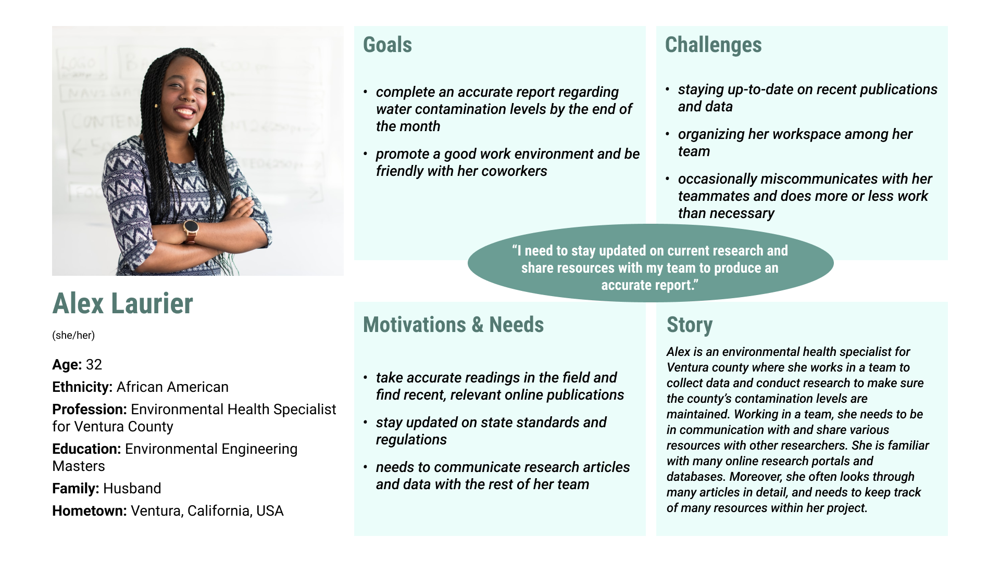
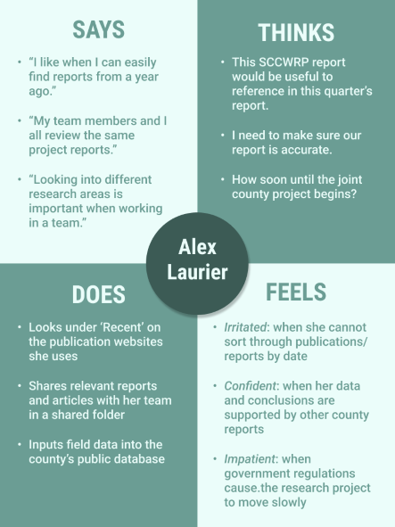
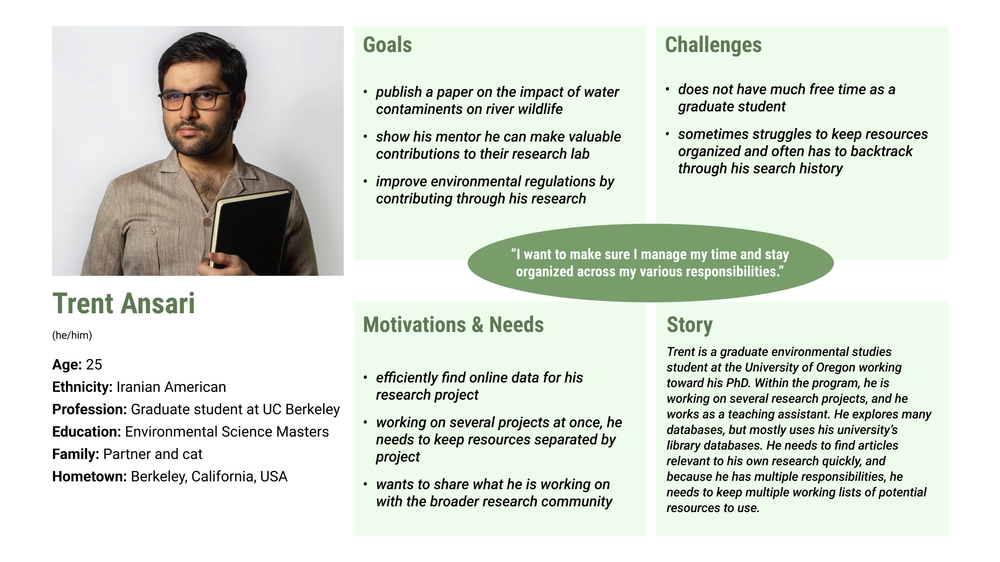
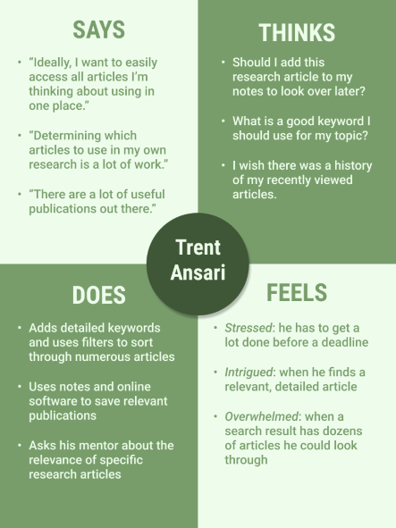

# Redesigning the SCCWRP's Online Interface

#### Lindsay Harrison, DH110 UX+UI Design, 2022 Fall UCLA

### Design Statement

The Southern California Coastal Water Research Project (SCCWRP) is responsible for researching marine waters and setting guidelines for the state. With such an important responsibility, it is integral they communicate and organize their research effectively. However, upon reviewing their website, I believe their site could improve to better share their findings with the public along with the institutions using their guidelines. With my UX design, I hope to improve their site's overall layout, facilitate navigation for users less expereinced with technology, and make the site more digestible for individuals curious about thier findings. As the site deals with state guidelines, the public should be able to easily navigate the site and deduce the main points of their research.

### Research

To begin, I conducted a [heuristic evaluation.](https://github.com/Lindsay36h/DH110-22F/tree/main/ASSIGNMENT01) In the evaluation, I analyzed the design of the SCCWRP's website, along with a similar organizaiton that connects research with companies on a larger scale - Ocean Visions - according to Nielson's 10 Heuristics for system usability.

After conducting the heuristic evaluation, I conducted [user research](https://github.com/Lindsay36h/DH110-22F/tree/main/ASSIGNMENT03) by interviewing a target user and analyzing their comments. To conduct user research for the SCCWRP’s website, I interviewed an individual representative of the target user group. This target user group features employed adults, between the ages of 25 and 35, who are interested in environmental sustainability research. The interview will consist of three main parts: background questions on the user’s history and relationship with finding environmental research, observing the user walk through three activities relevant to doing environmental research, and finally a set of questions regarding the frustrations and/or satisfaction they feel when doing these processes.

To better understand how I should implement changes to the Southern California Coastal Waters Research Project’s (SCCWRP) website, I needed to understand the goals, needs, and motivations of the website’s target users, along with the specific challenges and frustrations they face. I began my investigation of the target users by interviewing an environmental researcher. I then better defined this user group through [UX storytelling](https://github.com/Lindsay36h/DH110-22F/tree/main/ASSIGNMENT04). By creating user personas and describing a probable scenario they would face, I could better understand the user’s perspective and remove bias that may have been present in my user interview. For the website’s redesign, I implemented two tasks:

**Task 1: Search for relevant research articles**
This task will involve the website’s search functionality for publications and feature a more advanced ability to filter and organize search results. A user would enter keywords and specify publication type and genre before clicking a submit button, and looking through the results.

**Task 2: Navigate to a relevant database**
This task will center around an improved organization of the website. I will create a centralized databases page with links to subpages as well as links to the most popular databases presented at the top of the databases page. A user would search through these pages to find a database they are interested in.

#### Personas & Empathy Maps

### Design

The website currently consists of a home page along with the following subsections: About, Staff, Governance, Publications, Data, Contact. These pages each have various linked subpages that cannot be found within the website’s navigation bar. In beginning the website’s redesign, I created wireframes and a wireflow for two specific tasks that fall within the three general website functions. These tasks will be:

* Search for a recent article assessing the sea life in California’s coastal waters
* Find a the most recent publication and send it to a coworker
* Determine the presently available Requests for Proposals and submit your contact information to be added to the bider’s list

These wireframes were used to form a [low-fidelity prototype](https://github.com/Lindsay36h/DH110-22F/tree/main/ASSIGNMENT05) of a new version of the website. The purpose of creating a low-fidelity prototype is to create and test a new design for a product based on the user goals and pain points previously defined. Additionally, low-fidelity prototypes allow the development team to determine how the product should be designed before extensive time and resources are allotted to creating a functional, more detailed product prototype. Producing and testing a low-fidelity prototype allows the design process to be more iterative and thus produce a better-tested final product later.

After determining how these tasks would function within the website by creating a wireflow, I next had to determine a more polished design for the website. In an [exploration of the design interface](https://github.com/Lindsay36h/DH110-22F/tree/main/ASSIGNMENT06), I explored different typography, shape, and color variations for the website’s home page. The purpose of interface design is to translate wireframes into more finalized, polished designs by utilizing graphic design principles. These designs will later be part of a high-fidelity prototype resembling the finished product. To complete the process of interface design, I used Figma as my design tool and the MacBook Pro 14” screen size to frame the overall design. After determining a design I was satisfied with, I conducted an impression test and ran an accessibility test to determine how my designs could be improved.

Finally, I moved forward to create a [high-fidelity prototype](https://github.com/Lindsay36h/DH110-22F/tree/main/ASSIGNMENT07) of the website using Figma. The purpose of creating a high-fidelity prototype is to better visualize how information and elements appear on screen and to better understand the interactive components of the site and how exactly the user flow will function. Thus, after determining a design style for the website, I applied my designs to additional pages previously defined in the low-fidelity prototype and connected the pages through buttons and transitional animations to create an interactive high-fidelity prototype.

Similar to the tasks designed in the low-fidelity prototype, the tasks the interactive high-fidelity prototype will support include:

**TASK 1: Search for a journal article assessing the microbiology in California’s coastal waters.**

**TASK 2: Find a recent publication and email it to someone (a coworker).**

**TASK 3: Determine the presently available Requests for Proposals and submit your contact information to be added to the bider’s list.**

### Evaluation

To evaluate the high fidelity prototype, I conducted several usability studies, based on [one I had earlier designed and pilotted](https://github.com/Lindsay36h/DH110-22F/tree/main/ASSIGNMENT02) during the project. After updating the earlier usability test design to reflect better on what I had discovered and designed, the [usability tests](https://github.com/Lindsay36h/DH110-22F/tree/main/ASSIGNMENT07) revealed several important insights, which I used to further iterate on the design.

This section will be further completed at a later date.

### Presentation

This section will be further completed at a later date.
